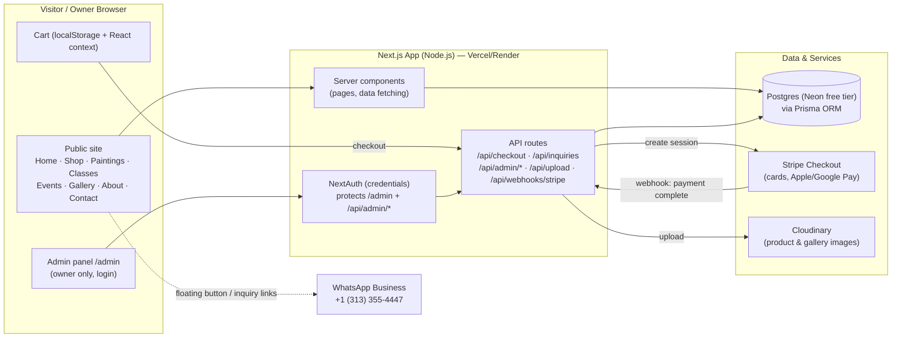
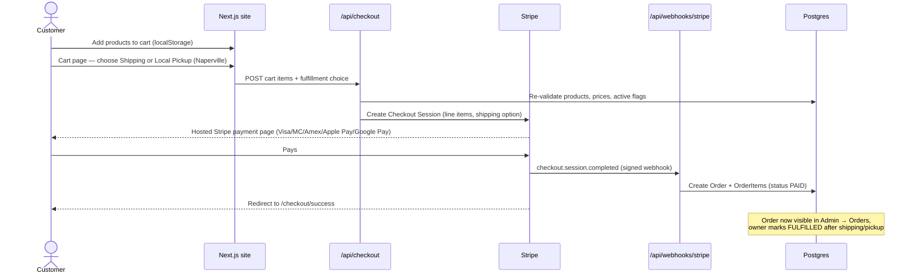
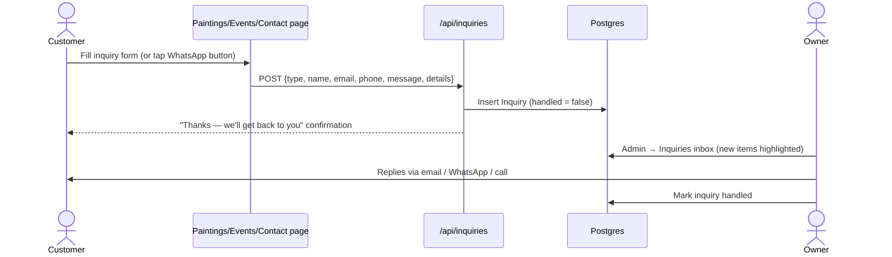
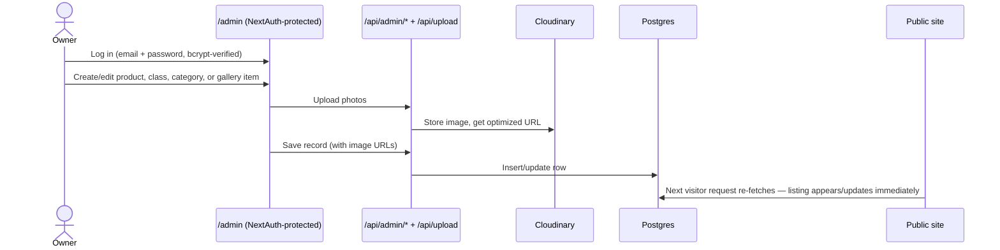

# ArtaeFlora — Architecture

Companion to [PLAN.md](PLAN.md). Diagrams are in Mermaid (rendered by GitHub, VS Code, and most Markdown viewers).

## 1. System Overview

One Next.js (App Router) application serves three surfaces — the public site, the admin panel, and the API routes — backed by Postgres and two external services (Stripe for payments, Cloudinary for image storage).



**Key decisions**

- **Single app** — public site, admin, and API in one Next.js codebase; one deploy, one free-tier host.
- **Server components by default** — product/gallery/class data is fetched on the server (good SEO for local search); the cart is the main client-side piece.
- **Stripe Checkout (hosted page)** — card data never touches our app; we only create a session and receive a webhook. No PCI burden.
- **Images in Cloudinary, not the database** — DB stores URLs only; Cloudinary resizes/optimizes. Local-disk fallback in development.
- **Inquiry-first for custom work** — paintings/events/classes create `Inquiry` rows (plus WhatsApp deep links); only priced products go through Stripe.

## 2. Data Model (ERD)

```mermaid
erDiagram
    Category ||--o{ Category : "subcategories"
    Category ||--o{ Product : "has"
    Product ||--o{ ProductImage : "photos"
    Product ||--o{ OrderItem : "ordered as"
    Order ||--|{ OrderItem : "contains"

    AdminUser {
        string id PK
        string email
        string passwordHash
    }
    Category {
        string id PK
        string name
        string slug
        string parentId FK "nullable — subcategory"
    }
    Product {
        string id PK
        string name
        string slug
        string description
        int priceCents "null when inquiryOnly"
        boolean inquiryOnly "paintings/custom work"
        string occasions "tags: Diwali, Wedding, ..."
        boolean active
        string categoryId FK
    }
    ProductImage {
        string id PK
        string url "Cloudinary URL"
        int sortOrder
        string productId FK
    }
    Class {
        string id PK
        string title
        string description
        string locationType "STUDIO | VENUE | ONLINE"
        string scheduleText
        int priceCents
        int capacity "max 10"
        boolean active "false = placeholder page"
    }
    Order {
        string id PK
        string stripeSessionId
        string customerName
        string customerEmail
        string fulfillment "SHIPPING | PICKUP"
        string status "PAID | FULFILLED"
        int totalCents
        datetime createdAt
    }
    OrderItem {
        string id PK
        string orderId FK
        string productId FK
        int quantity
        int unitPriceCents "price at purchase time"
    }
    Inquiry {
        string id PK
        string type "PAINTING | EVENT | CLASS | GENERAL"
        string name
        string email
        string phone
        string message
        string details "event date/headcount/venue etc."
        boolean handled
        datetime createdAt
    }
    GalleryItem {
        string id PK
        string url "Cloudinary URL"
        string caption
        string tag "candles | paintings | classes | events"
    }
    HeroSlide {
        string id PK
        string mediaType "IMAGE | VIDEO"
        string url "Cloudinary URL (jpeg, png, gif, mp4, webm)"
        string caption "optional overlay text"
        int sortOrder
        boolean active
    }
    SiteSetting {
        string key PK "e.g. announcementText, announcementEnabled"
        string value
    }
```

## 3. Checkout Flow (priced products)



## 4. Inquiry Flow (paintings · events · classes · general)



## 5. Admin Content Flow



## 6. Image & Asset Management

Two kinds of images, with different lifecycles:

**Brand assets** — the logo family. Change almost never, ship with the code.
- `brand-assets/` (repo root) — originals and source material (drawn logo, business cards). Never served to visitors; kept for reference and future design work.
- `public/brand/` — web-ready versions (transparent PNGs). Referenced by fixed paths in code (e.g. header logo).

**Content images** — products, gallery, hero. Grow forever, owned by the admin panel, referenced **only by URL stored in the database** (never hardcoded in code):

| | Development | Production |
|---|---|---|
| Storage | `public/uploads/{products,gallery,hero}/` (git-ignored) | Cloudinary folders `artaeflora/{products,gallery,hero}` |
| Naming | upload API assigns collision-proof IDs (cuid), never the original filename | same |
| Optimization | `next/image` resizes/serves WebP on the fly | Cloudinary `f_auto,q_auto` + `next/image` |
| Alt text / captions | stored in DB (`ProductImage.alt`, `GalleryItem.caption`) | same |

Rules that keep this scalable:
1. **The database is the source of truth.** Pages never enumerate image folders; they render whatever URLs the DB rows hold. Swapping storage backends is a URL-prefix change, not a code rewrite.
2. **Uploads are append-only with generated names** — no collisions, no accidental overwrites; deleting a product deletes its image rows (DB cascade) and the upload API removes the files.
3. **One upload path** (`/api/upload`) decides the backend: Cloudinary when `CLOUDINARY_URL` is set, local disk otherwise. Nothing else in the app knows or cares.
4. **Seed placeholders** (`public/products/*.png`) are repo-shipped stand-ins used only until real photos are uploaded; they get retired as products gain real images.
5. **Scale path**: Cloudinary free tier comfortably covers hundreds of products (~25 GB bandwidth/month); beyond that it's a paid-tier bump or a move to S3 + CDN — either way only the upload API changes (rule 3).

## 7. Environments & Configuration

| Environment | Database | Images | Payments | URL |
|---|---|---|---|---|
| Local dev | Neon (dev branch) or local fallback | Local `public/uploads` fallback | Stripe **test mode** | `localhost:3000` |
| Production | Neon (main branch, free tier) | Cloudinary (free tier) | Stripe **live mode** | `artaeflora.com` (to be purchased) |

Environment variables: `DATABASE_URL`, `NEXTAUTH_SECRET`, `NEXTAUTH_URL`, `STRIPE_SECRET_KEY`, `STRIPE_WEBHOOK_SECRET`, `NEXT_PUBLIC_STRIPE_PUBLISHABLE_KEY`, `CLOUDINARY_URL` — documented in the README; never committed to git.
